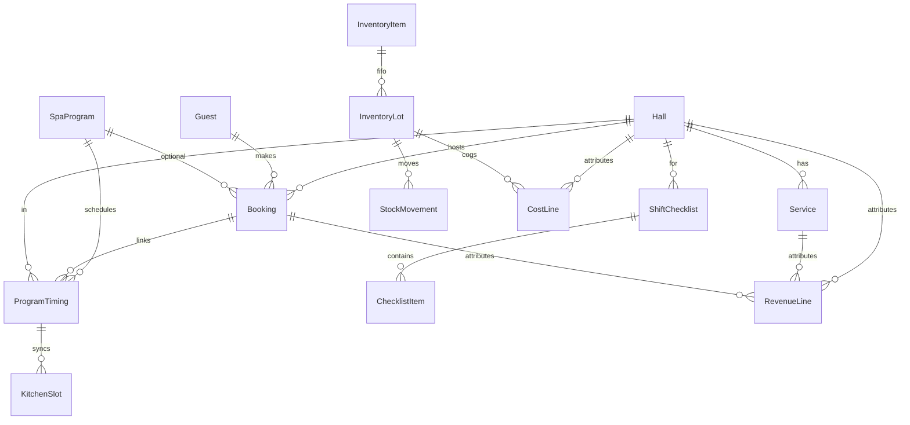

# Architecture — Banya-Digital ERP

## Принцип

**Модульный монолит:** один Next.js-процесс, логика разделена по `modules/`, UI — по `app/(app)/`.  
Новые фичи добавляются в свой модуль без переписывания соседей.

## Слои

```
app/(app)/          → маршруты и страницы (тонкий слой)
components/         → UI (layout, shadcn/ui)
modules/            → доменная логика, типы, будущие services
lib/                → общие утилиты, config, db
knowledge-base/     → спеки Muster (не runtime)
prisma/             → схема PostgreSQL (источник истины для БД)
```

## Модули

| Модуль | Путь UI | Папка | Назначение |
|--------|---------|-------|------------|
| dashboard | `/dashboard` | `modules/dashboard/` | KPI, сводки |
| finance | `/finance` | `modules/finance/` | Unit economics |
| crm | `/crm` | `modules/crm/` | Гости, брони |
| operations | `/operations` | `modules/operations/` | Yield, чеклисты, тайминги, FIFO |

### Operations (подмодули)

- `operations/checklists/` — чеклисты смен
- `operations/timings/` — spa + kitchen sync
- `operations/inventory/` — FIFO органика (hay, fir)

## Data model (T-002)

**ORM:** Prisma 7 → PostgreSQL.  
**CLI:** `prisma.config.ts` — `DATABASE_URL` (see `.env.example`).  
**Client:** `lib/db/index.ts` — singleton `prisma` with `@prisma/adapter-pg` for Server Components and API routes.

### Таблицы по домену

| Домен | Модели Prisma | Назначение |
|-------|---------------|------------|
| Core | `Hall`, `Service` | Залы/зоны, услуги и товары |
| CRM | `Guest`, `Booking`, `SpaProgram` | Гости, брони, программы |
| Operations | `ProgramTiming`, `KitchenSlot` | Тайминги spa + sync кухни |
| Operations | `ShiftChecklist`, `ChecklistItem` | Чеклисты смен |
| Inventory | `InventoryItem`, `InventoryLot`, `StockMovement` | FIFO сено/пихта |
| Finance | `RevenueLine`, `CostLine` | Выручка и COGS по залу/дню |

Полная схема: `prisma/schema.prisma` (комментарии по модулям).

### ER overview



### FIFO (контур)

- Партии: `InventoryLot.quantityLeft` уменьшается при `StockMovement` типа `OUT`.
- Списание по FIFO — в сервисном слое (`modules/operations/inventory/`), не в триггерах БД (MVP).
- COGS органики: `CostLine.lotId` → `InventoryLot`.

### Unit economics (контур)

- `RevenueLine` / `CostLine` с `businessDate`, опционально `hallId`, `serviceId`.
- Маржа по залу/дню — агрегаты в finance module / dashboard (T-003+).

## Расширение (Phase 1+)

1. ~~**T-002:** `lib/db/` + Prisma + PostgreSQL~~
2. Каждый модуль получает `modules/<name>/services/` и API routes `app/api/<name>/`
3. **Auth (T-009, DONE):** **Auth.js v5** + Prisma adapter, Credentials, JWT session. Роли `owner | ops | admin | warehouse` в `User.role` / `session.user.role`. Middleware защищает `/dashboard`, `/finance`, `/crm`, `/operations`. ADR: `architecture-decisions.md` ADR-001. RBAC по модулям (finance write) — следующая итерация.
4. Dashboard читает агрегаты из finance + operations

## Конфиг

- `lib/modules.ts` — реестр модулей для nav
- `.env.example` — `DATABASE_URL`
- npm: `db:generate`, `db:push`, `db:migrate`
