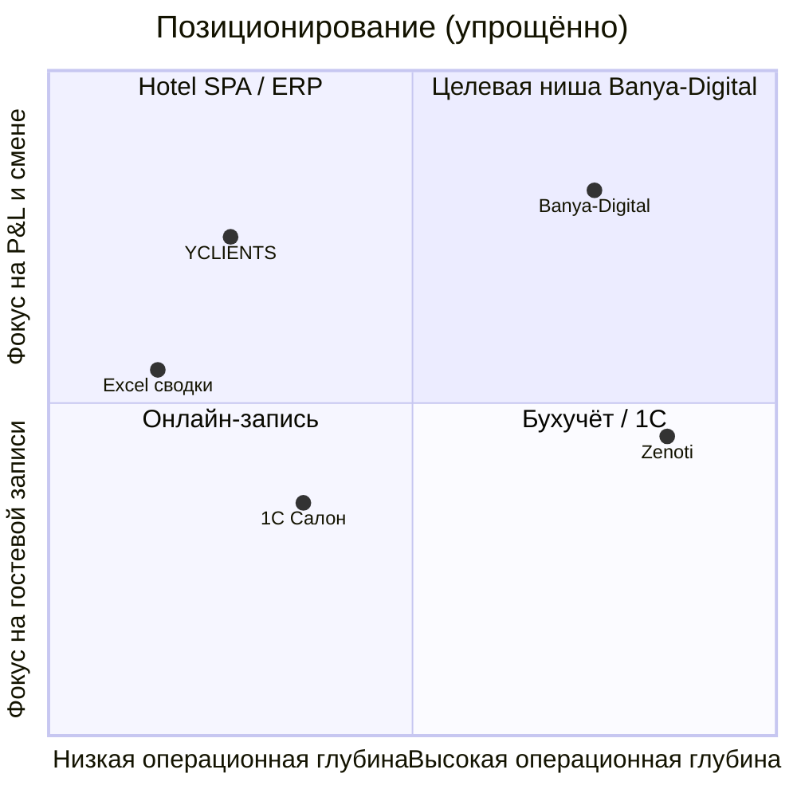

# Сегмент SPA / банные комплексы — анализ и адаптация Banya-Digital

**Дата:** 2026-05-26  
**Автор:** PM (muster-pm)  
**Аудитория:** Pavel (Human Architect), команда Muster  
**Статус:** внутренняя памятка для решений по ICP, backlog и GTM  
**Product Map:** фазы **1 Strategy**, **2 Generation**, **3 Analysis** (Delivery — в рекомендациях `T-0xx`)

**Связанные артефакты:** `product-brief.md`, `architecture.md`, `docs/management-overview.md`, `orchestration-queue.md` (T-009…T-017)

---

## Executive summary

Banya-Digital уже попадает в нишу **операционного B2B-дашборда** премиального банно-SPA комплекса (yield, unit economics, kitchen↔SPA, FIFO органики), а не в рынок **онлайн-записи гостя**. Для сегмента «SPA / банные комплексы» сильная сторона — **единая картина смены для владельца и ops**; главные пробелы — **ввод живых данных** (T-011…T-013), **персонал и смены**, **розница/абонементы**, **сезонность и план**, **комплаенс**. Демо «Дегтярные Бани» (4 зала, ~196 тыс ₽/день, yield 60–80%, конфликт кухни, FIFO сено/пихта) — **учебный эталон**, не отраслевой стандарт всех комплексов. Позиционирование: **«операционный ERP-слой поверх записи и кассы»** для объектов 1 500–8 000 м² с несколькими зонами и F&B. Приоритет P0 на 8-недельный пилот — закрыть READY-задачи T-011…T-013 + T-014 и поднять T-017 (SME).

---

## 1. Аудит текущего состояния

### 1.1 Продуктовая рамка (из brief и management-overview)

| Элемент | Содержание |
|---------|------------|
| **Обещание** | Премиальный ERP/CRM: unit economics, yield залов, sync spa↔кухня, FIFO органики |
| **ICP (текущий)** | Один премиальный комплекс, 1 tenant; владелец, ops, склад, CRM-админ |
| **Не делаем в v1** | 1С, НДС, гостевое приложение, мультифилиал, полный RBAC (до T-009) |
| **Демо-бренд** | «Дегтярные Бани» — fictional, Neon + Vercel, без пароля |

### 1.2 Модули и зрелость реализации

| Модуль | UI | Данные | Зрелость | Комментарий для сегмента SPA/бани |
|--------|-----|--------|----------|----------------------------------|
| **dashboard** | KPI, алерты, ops block, чеклисты | PostgreSQL (T-006 DONE) | **Демо+prod read** | Сильный «утренний пульт» владельца; нет редактирования с dashboard |
| **finance** | Unit economics по залам | Read из `RevenueLine`/`CostLine` | **Read-only** | T-011 READY — без ввода пилот на живых данных невозможен |
| **crm** | Гости, брони на сегодня | Read | **Read-only** | Нет CRUD, конфликтов слотов в UI (T-010 READY) |
| **operations** | Тайминги, kitchen slots, ссылка на чеклисты | Read + seed-сценарии | **Read + демо-конфликт** | Kitchen↔SPA — дифференциатор vs YCLIENTS; нет resolve workflow |
| **operations/inventory** | Алерты на dashboard | Модель + seed | **Нет экрана FIFO** | T-012 READY — критично для COGS и маржи |

### 1.3 Модель данных (Prisma) — сильные сущности для сегмента

| Домен | Модели | Покрытие сегмента | Пробел |
|-------|--------|-------------------|--------|
| Core | `Hall`, `Service` | Зоны (парная, хамам, VIP, сеновал) | Нет «термальной зоны / бассейн» как типа; нет вместимости по слотам |
| CRM | `Guest`, `Booking`, `SpaProgram` | Бронь + программа | Нет абонементов, депозитов, корпоративных договоров |
| Ops | `ProgramTiming`, `KitchenSlot` | Мультиресурсная смена | Нет мастера/ресурса как сущности; `staffLabel` — строка |
| Ops | `ShiftChecklist`, `ChecklistItem` | Регламент смены | Нет привязки к сотруднику (T-013 out of scope) |
| Inventory | `InventoryItem`, `InventoryLot`, `StockMovement` | FIFO органика | Узко: HAY/FIR; нет косметики, F&B, белья |
| Finance | `RevenueLine`, `CostLine` | Маржа по залу/дню | `CostType.LABOR` в схеме, но нет учёта смен персонала |

**Вывод по схеме:** ядро **осознанно заточено под премиальную русскую баню** (органика, кухня под ритуал, залы). Для сетевого urban SPA (Termoland-тип) нужны расширения, но **не замена** ядра.

### 1.4 Демо-контекст (live seed)

| Параметр | Значение в демо | Реальность сегмента |
|----------|-----------------|---------------------|
| Залы | 4: Парная, VIP, Сеновал, Хамам | 3–12 зон (термы, бассейны, private suites) |
| Yield «Итого» | 60–80% (цель пилота ~60%) | Сильная сезонность; будни 35–55%, выходные 75–95% |
| Выручка/день | ~196 000 ₽ | От ~80 тыс (малый клуб) до 1+ млн (флагман) |
| Маржа день | ~30–35%; услуги &lt;40% — намеренно | Зависит от mix F&B vs процедуры |
| Склад | FIFO сено/пихта, алерты | + расходники SPA, F&B, прачечная |
| Kitchen↔SPA | Конфликт в seed для алертов | Критично для авторских программ; в «термах-only» — слабее |

### 1.5 Очередь Muster T-009…T-017 (снимок 2026-05-26)

| ID | Задача | Статус | Релевантность сегменту |
|----|--------|--------|------------------------|
| T-009 | Auth / роли | BACKLOG | P1 для пилота с несколькими ролями (owner vs ops vs склад) |
| T-010 | CRM CRUD + конфликт слотов | READY | P1 — админская запись, не замена YCLIENTS |
| T-011 | Finance input | READY | **P0** — без этого нет «живой» unit economics |
| T-012 | FIFO UI | READY | **P0** для бань с органикой; P1 для «чистого» urban SPA |
| T-013 | Чеклисты смены | READY | **P0** — закрытие смены −30% |
| T-014 | Регламент пилота 8 нед | READY | **P0** — People / pilot |
| T-015 | Product Map Phase 2 | BACKLOG (partial) | ICP/NSM — дополнить этим документом |
| T-016 | iGaming BiJi | BACKLOG | Вне scope |
| T-017 | SME operational brief | BACKLOG | **P0 discovery** — валидировать боли поля |

### 1.6 Сильные стороны vs реальный оператор SPA/бани

| Сила | Почему ценно |
|------|--------------|
| **Unit economics по залу за день** | Владелец видит «какой зал кормит P&L», а не только выручку кассы |
| **Yield / загрузка залов** | RevPAT-логика без перегруза математикой |
| **Kitchen ↔ SPA sync** | Редко в salon-CRM; боль авторских программ и F&B |
| **FIFO + COGS на маржу** | Прозрачность себестоимости ритуалов (сено, пихта, масла) |
| **Единый dashboard алертов** | Простой, конфликт, склад — «что горит сейчас» |
| **Модульный монолит + Prisma** | Быстрый пилот на одном VPS/Neon без зоопарка интеграций |

### 1.7 Пробелы vs оператор (полевые боли)

| Боль оператора | Есть в продукте? | Зазор |
|----------------|------------------|-------|
| Онлайн-запись, напоминания, no-show | Нет (out of scope) | Не конкурировать с YCLIENTS/DIKIDI — интеграция позже |
| Расписание мастеров / ресурсов | Частично (`ProgramTiming`, строка staff) | Нет skills, смен, загрузки персонала |
| Касса, ФЗ-54, эквайринг | Нет | Excel/1С/касса остаётся source of cash |
| Зарплата, мотивация мастеров | Enum `LABOR`, без UI | Средний приоритет для премиума |
| Розница бара/бутика в зале | `ServiceKind.PRODUCT` | Нет POS-потока и списания со склада в смену |
| Абонементы, корпоративы | Нет | Важно для urban SPA и сетей |
| Сезонность, план/факт | Delta «к вчера» | Нет недельного плана, праздников, погоды |
| Санитария, журналы, Роспотреб | Нет | Риск «ещё одна система» без compliance |
| Мультифилиал / франшиза | Out of scope v1 | Сети Termoland/Siberia — Phase 3+ |
| Мобильный доступ duty manager | Responsive web only | Нет PWA/offline |

### 1.8 Что строго demo-only

- Бренд «Дегтярные Бани», фиксированные 4 зала и русские ритуалы в seed  
- Все KPI без T-011 — **пересчитываются только из seed**, не из кассы  
- Отсутствие auth — любой с URL видит финансы  
- Конфликт kitchen↔SPA — **заранее заложен** для демо алертов  
- Целевой yield 60% — **пилотная гипотеза**, не бенчмарк рынка  
- Ссылки Vercel/Neon — инфраструктура демо, не SLA production  

---

## 2. Рынок и конкурентное поле

### 2.1 Тренды RU/CIS (2024–2026, качественно)

Источники: [BusinesStat — рынок SPA](https://www.businesstat.ru/catalog/id83165/), [Snob / рост спроса на бани и SPA](https://snob.ru/news/v-rossii-nametilsya-bum-sprosa-na-uslugi-ban-i-spa/), [Forbes / молодая аудитория бань](https://chistopar.ru/magazine/news/forbes-30-letnie-uskorili-rost-bannoi-industrii), [Метриум — urban «курорты у дома»](https://nbj.ru/publs/metrium_u_rossiyan_vyros_spros_na_format_g/71700/).

| Тренд | Следствие для продукта |
|-------|------------------------|
| Рост wellness и «банного» досуга, в т.ч. 25–40 лет | Спрос на **операционную дисциплину** при большем трафике и сложных программах |
| Формат **городских терм / SPA-комплексов** (крупные площади, несколько зон) | Нужны **yield по зонам**, не только по мастеру |
| Премиум-игроки (Siberia, сетевые термы) | Конкуренция **опытом и маржой**, не ценой входа |
| Дорожание расходников (импорт, органика) | **COGS и FIFO** — не «фишка демо», а экономическая необходимость |
| Цифровизация записи через агрегаторы | **Запись отделена от управления сменой** — окно для B2B ops-слоя |

*Количественные обороты рынка SPA — в платных отчётах BusinesStat; в публичных материалах фиксируется рост затрат клиента (~13→17 тыс ₽/чел/год в 2020–2024) и экспансия сетей, без единой цифры TAM для «банных ERP».*

### 2.2 Глобальный контекст (where relevant)

Рынок **resort/hotel spa software** (Zenoti, Book4Time, Agilysys) фокусируется на **RevPAT, dynamic pricing, PMS-интеграции, staffing** ([Zenoti resort spa](https://www.zenoti.com/spa-management-software/resort-spa), [Coaxsoft overview](https://coaxsoft.com/blog/10-best-spa-management-software-for-hotels)). Для standalone urban SPA в РФ это **избыточно и дорого**; идеи для roadmap: yield-мышление, utilization, gap alerts — **без** AI pricing в v1.

### 2.3 Боли операторов (приоритет для нашего ICP)

| Боль | Частота | Текущий workaround |
|------|---------|-------------------|
| Не видят маржу по зоне/программе в день | Высокая | Excel раз в неделю |
| Простой зал / «дыры» в расписании | Высокая | Админ + YCLIENTS, без агрегации |
| Рассинхрон кухни и программы | Средняя (премиум-баня) | Телефон, чаты |
| Списание органики «на глаз» | Средняя | Тетрадь склада |
| Долгое закрытие смены | Высокая | 30–60 мин сводок |
| Сезонные кассовые провалы | Высокая | Скидки без аналитики mix |
| Текучка мастеров / сложное расписание | Высокая | YCLIENTS + Excel |
| Комплаенс и журналы | Средняя | Бумага + 1С |

### 2.4 Альтернативы и конкуренты

| Класс | Примеры | Сильные стороны | Слабые для нашего ICP |
|-------|---------|-----------------|------------------------|
| **Таблицы** | Google Sheets, Excel | Гибкость, привычка | Нет live alerts, ошибки, нет FIFO |
| **1С / учёт** | 1С:Салон, SPA CRM ([salon1c.ru](https://salon1c.ru/for-spa/)) | Налоги, склад, РФ-реестр | Тяжёлое внедрение; слабый **операционный пульт смены** |
| **Запись + CRM** | YCLIENTS, DIKIDI, Saby Clients ([saby.ru/clients](https://saby.ru/clients)) | Запись, лояльность, мастера | Слабый **unit economics по залу**, kitchen sync, FIFO ритуалов |
| **Vertical salon** | Малахит, Параплан | Локальный рынок | Фокус мастер/кабинет, не **зал-как-P&L** |
| **Hotel/resort spa** | Zenoti, Agilysys | RevPAT, PMS | Цена, нет фокуса на русской бане |
| **Generic ERP** | Odoo, Битрикс | Универсальность | Долго, нет отраслевой семантики |

### 2.5 Размер сегмента (качественно)

| Слой | Оценка |
|------|--------|
| **TAM (RU wellness + бани + urban SPA)** | Крупный и растущий рынок услуг; десятки новых комплексов в год в МО и миллионниках ([Метриум: 22 термальных объекта в pipeline 2025](https://nbj.ru/publs/metrium_u_rossiyan_vyros_spros_na_format_g/71700/)) |
| **SAM (премиум / middle+, 1 объект, 4+ зоны, F&B)** | Сотни действующих объектов + greenfield; точный счёт — через SME + отраслевые каталоги |
| **SOM (пилоты Banya-Digital, 12 мес)** | 3–8 комплексов при ручном пилоте и рефералах; не массовый PLG |

### 2.6 Окно позиционирования

**Тезис:** Banya-Digital = **операционный ERP-дашборд для владельца и ops** комплекса с несколькими зонами и F&B, **не** замена виджета записи.

---

## 3. Предложения (actionable)

### 3.1 Позиционирование для «SPA / банные комплексы»

**ICP (рекомендуемая формулировка для Architect sign-off):**

> Владелец или управляющий **одного** премиального или upper-middle **банно-SPA комплекса** (1 500–8 000 м², 3–10 зон, kitchen/F&B, штат 15–80), который уже использует **запись/кассу** (YCLIENTS, 1С, Excel), но **не видит маржу и загрузку зон в реальном времени** и теряет деньги на простое, органике и рассинхроне программ.

**JTBD (владелец):**  
*Когда* заканчивается смена, *я хочу* за 15–30 минут понять P&L по зонам и что сгорело по операциям, *чтобы* завтра поправить слоты и закупки без недельной сводки в Excel.

**Дифференциация:**

| Мы | Не мы |
|----|-------|
| Yield + маржа по **залу/зоне** | Онлайн-запись гостя |
| Kitchen ↔ SPA + FIFO COGS | Полная бухгалтерия |
| Пульт **текущей смены** | AI dynamic pricing (v1) |
| OSS, self-host, прозрачная модель данных | Закрытый чёрный ящик SaaS |

### 3.2 Feature gaps → модули (P0 / P1 / P2)

| Приоритет | Фича | Модуль | Связь с очередью |
|-----------|------|--------|------------------|
| **P0** | Ввод выручки/COGS за день | finance | T-011 |
| **P0** | FIFO списание + экран склада | operations/inventory, dashboard | T-012 |
| **P0** | Чеклисты смены (N/M) из БД | operations, dashboard | T-013 |
| **P0** | Регламент 8-нед пилота | docs | T-014 |
| **P0** | SME: day-in-life, anti-features | knowledge-base | T-017 |
| **P1** | CRM: гость + бронь + конфликт зала | crm | T-010 |
| **P1** | Auth + роли (owner/ops/warehouse) | cross-cutting | T-009 |
| **P1** | Resolve workflow kitchen conflict | operations | **T-018** (новая) |
| **P1** | План/факт выручки (неделя) | finance, dashboard | **T-019** |
| **P1** | Типы зон (термы/бассейн/баня) в справочнике | core `Hall` | **T-020** |
| **P2** | Розница/бар: быстрый COGS product | finance + inventory | **T-021** |
| **P2** | Сезонный календарь (праздники, каникулы) | dashboard | **T-022** |
| **P2** | Экспорт в 1С / CSV для бухгалтера | finance | **T-023** BLOCKED |
| **P2** | Интеграция webhook YCLIENTS (read bookings) | crm | **T-024** BLOCKED |

### 3.3 Демо: что оставить / переименовать

| Оставить | Переименовать / параметризовать |
|----------|----------------------------------|
| 4 зала как **шаблон** multi-zone | White-label: название комплекса, не только «Дегтярные Бани» |
| Yield ~60% как **пилотный target** | Подпись «цель пилота», не «норма отрасли» |
| FIFO сено/пихта | Добавить 2-й пресет seed: **urban SPA** (косметика + F&B, без органики) |
| Kitchen↔SPA конфликт | Toggle в seed: `spaOnly` vs `banyaFull` |
| ~196 тыс ₽/день | Диапазон в management-overview: «малый / средний / флагман» |
| Premium UI tokens | Сохранить; опционально тема «термы» (холодные акценты) — P2 UI |

### 3.4 GTM (handoff CMO) — 3 bullets

1. **Сообщение:** «Единый пульт смены: маржа по зонам, yield и алерты — без замены вашей записи» — лендинг и демо для **управляющего**, не администратора ресепшена.  
2. **Канал:** пилоты через **отраслевые чаты, подрядчиков fit-out бань, консультантов** (SME T-017 → кейс «−30% закрытие смены»); не performance на B2C.  
3. **Доказательство:** 8-недельный пилот с метриками из brief (маржа daily, FIFO ≥95%, 0 необработанных kitchen conflicts) + запись demo 15 мин **dashboard → finance**.

### 3.5 Рекомендуемые задачи Muster (новые T-0xx)

| ID | Название | Роль | Приоритет | Зависимости | Notes (фаза карты) |
|----|----------|------|-----------|-------------|-------------------|
| **T-018** | Operations: resolve kitchen↔SPA conflict + audit log | Developer | P1 | T-006 | Delivery; SME: регламент |
| **T-019** | Finance: план/факт недели на dashboard | Developer | P1 | T-011 | Analysis |
| **T-020** | Hall zone types + seed preset «urban SPA» | Developer | P2 | T-006 | Generation |
| **T-021** | Retail COGS: PRODUCT revenue + inventory OUT | Developer | P2 | T-012 | Analysis |
| **T-022** | Seasonality calendar (holidays) в KPI delta | PM/Developer | P2 | T-019 | Analysis |
| **T-023** | Export CSV / 1С stub | Developer | P2 | T-011 | BLOCKED: формат 1С → Architect |
| **T-024** | YCLIENTS read-only import (bookings) | Developer | P2 | T-010, T-009 | BLOCKED: API/legal |
| **T-025** | PM: обновить ICP/позиционирование в brief post-SME | PM | P1 | T-017 | Strategy; частично этот doc |

*PM не добавляет строки в `orchestration-queue.md` автоматически в этой сессии — Human подтверждает ID T-018+ при груминге.*

### 3.6 Риски и anti-features (SME lens)

| Anti-feature | Почему опасно |
|--------------|---------------|
| Стать «ещё одной CRM записи» | Проигрыш YCLIENTS; размытие ICP |
| AI pricing / прогноз спроса в v1 | Нет данных, недоверие владельца |
| Полный склад всех SKU | Внедрение 6+ мес; убьёт пилот |
| Мультифилиал в маркетинге | Обещание без архитектуры tenant |
| Жёсткий RBAC без обучения | Ops перестанут вносить данные |
| Игнор кассы/ФЗ-54 | Юридические ожидания → отказ |
| «Универсальный wellness ERP» | Потеря остроты баня+kitchen+FIFO |

| Риск | Mitigation |
|------|------------|
| Пилот без T-011…013 — только красивый dashboard | Не стартовать пилот до DONE T-011…013 |
| Сегмент urban SPA без органики — «пустой» FIFO | Второй seed preset; FIFO P1 не P0 для них |
| Architect не подтвердит ICP | T-015 остаётся BACKLOG; BLOCKED в brief |

---

## 4. Решения для Human Architect

1. **Подтвердить ICP** из §3.1 или скорректировать (urban-only vs баня+кухня).  
2. **North Star пилота:** daily margin visibility **или** −30% close shift time — выбрать один OMTM.  
3. **Добавить T-018…T-025** в очередь или сжать в один epic «Segment SPA».  
4. **Поднять T-017 (SME) в READY** до масштабного маркетинга.  
5. **Commit:** по запросу — `docs: SPA/banya segment analysis`.

---

## Источники (внешние)

- BusinesStat — анализ рынка SPA РФ 2021–2030 (платный отчёт, публичные тезисы о росте затрат)  
- Snob.ru — спрос на бани и SPA  
- Chistopar / Forbes — молодая аудитория бань  
- NBJ / Метриум — urban термы, рост расходов на SPA 2025  
- Zenoti, Coaxsoft — resort spa ops (глобальный бенчмарк)  
- salon1c.ru, saby.ru/clients, picktech.ru — альтернативы YCLIENTS  

---

*Следующий шаг PM: после sign-off Human — строки T-018+ в `orchestration-queue.md`, обновление `product-map-workflow.md` (ICP closed), handoff CMO на §3.4.*
