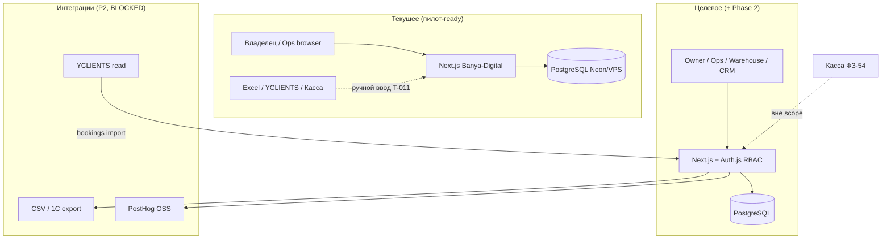

# Предложения команды Muster: адаптация Banya-Digital под сегмент SPA / банные комплексы

> **Консолидированная версия для команды:** [`SPA-SEGMENT-TEAM-REVIEW.md`](SPA-SEGMENT-TEAM-REVIEW.md)

**Дата:** 2026-05-26  
**Инициатор:** Human Architect (запрос «предложения от всех ролей»)  
**Product Map:** фазы **1 Strategy** → **2 Generation** → **3 Analysis** (артефакты Delivery — в эпиках `T-0xx`)  
**Статус:** консолидированный handoff; не заменяет `orchestration-queue.md`

**Опора на аудит:** `@knowledge-base/segment-spa-banya-analysis.md` (PM, 2026-05-26). Краткий вывод аудита — в §0.

**Связанные артефакты:** `product-brief.md`, `architecture.md`, `docs/management-overview.md`, `orchestration-queue.md` (T-009…T-017, кандидаты T-018+)

---

## 0. Аудит (сводка из segment-spa-banya-analysis)

| Вопрос | Ответ |
|--------|--------|
| **Куда попадаем сейчас** | Операционный B2B-дашборд: yield, unit economics, kitchen↔SPA, FIFO — не онлайн-запись гостя |
| **ICP (черновик)** | 1 комплекс, 1 500–8 000 м², 3–10 зон, F&B, уже есть YCLIENTS/Excel |
| **Зрелость** | Dashboard read из БД (T-006 DONE); finance/CRM/ops — **read-only**; T-011…T-013 **READY** |
| **Демо** | «Дегтярные Бани» — эталон, не норма рынка; yield 60% — цель пилота |
| **Позиционирование** | «ERP-слой поверх записи и кассы» для P&L и смены |
| **Пробелы** | Ввод данных, auth, resolve конфликтов, персонал, абонементы, сезонность, комплаенс |

---

## 1. SME — отраслевой бизнес-консультант

*Роль: `Role: SME` / `muster-sme` · Handoff: T-017 → `industry-brief.md`*

- **Day-in-life управляющего смены (08:00–23:00):** до открытия — сверка броней и «дыр» в YCLIENTS; 10:00–14:00 — пик заездов, конфликт «парная занята / кухня не готова»; 18:00 — вторая волна VIP; 22:30–23:30 — **45 мин** сводки в Excel (выручка, списания, кто не пришёл). Система должна сжать блок 22:30 до **≤30 мин** чеклистом + готовыми KPI.
- **Скрытая боль — «левый» гость в зале:** админ сажает без брони, выручка не в зале-P&L; прокси-KPI: расхождение **брони vs фактические сеансы** по залу (позже — интеграция, сейчас — дисциплина CRM T-010).
- **Скрытая боль — списание органики без партии:** масло/сено «на глаз» → маржа 40%+ в отчёте, 25% в жизни; **FIFO OUT обязателен** перед закрытием смены (T-012), иначе владелец принимает решения на фантазии.
- **MUST KPI на первом экране (7):** (1) выручка день vs вчера, (2) yield «Итого» + худший зал, (3) маржа % день, (4) count критических алертов, (5) необработанные kitchen↔SPA, (6) алерты склада, (7) чеклист закрытия N/M — без прокрутки.
- **Anti-features:** модуль зарплат мастеров в MVP; «универсальный CRM записи»; журнал Роспотребнадзора без регламента внедрения; мультифилиал в обещаниях продаж.
- **Критика generic ERP:** Odoo/Битрикс заставят завести 200 справочников до первого алерта; YCLIENTS даёт мастера, но **не зал как P&L** — наш клин: зона = центр unit economics, не кабинет парикмахера.

---

## 2. CMO — директор по маркетингу

*Роль: `Role: CMO` / `muster-growth-marketer` · Handoff: `marketing-brief.md` (создать), гипотезы → PM*

- **ICP-сегменты (B2B):** (A) **премиум-баня** 4+ зоны + кухня под ритуал; (B) **urban термы** 6–12 зон, слабее kitchen sync, сильнее yield/F&B; (C) **реконструкция** (новый комплекс, нет процессов) — длинный цикл, высокий LTV. Не таргетировать: салоны красоты, сети 15+ точек без tenant-модели.
- **Каналы B2B (90 дней):** отраслевые Telegram/WhatsApp чаты владельцев бань; подрядчики **fit-out** и проектировщики парных; консультанты «запуск бани»; **не** performance на B2C; 2–3 пилотных кейса с цифрами −30% закрытие смены.
- **AARRR оператора (не гостя):** Acquisition = demo 15 мин для **управляющего**; Activation = первый день с **вводом RevenueLine** (T-011) и алертом на dashboard; Retention = ежедневный утренний ритуал владельца (D7 login); Referral = «покажи коллеге-владельцу» после пилота; Revenue = setup + MRR per complex (не per guest).
- **LTV:CAC (napkin, 1 комплекс):** ARPU **25–45 тыс ₽/мес** (middle preset), gross margin **80%**, lifetime **24 мес** → LTV **~480–860 тыс ₽**; CAC **120–200 тыс ₽** (sales-assisted, 2 визита + онбординг) → **LTV:CAC ~2,4–4,3** — масштабировать paid только после **≥3 кейсов** и Activation &gt;60%.
- **OSS analytics events (PostHog self-host, ADR Architect):** `demo_opened`, `kpi_viewed` (hall_load, margin), `alert_clicked`, `finance_line_created`, `fifo_out_completed`, `checklist_item_toggled`, `pilot_week_N` — без PII гостя в event properties.
- **Сообщение GTM:** «Ваша запись остаётся. Мы даём **пульт смены**: маржа по зонам, yield, кухня↔SPA, склад — за 8 недель пилота с метриками в договоре».

---

## 3. PM — продакт-менеджер

*Роль: `Role: PM` / `muster-pm` · Product Map: Strategy → Analysis → Delivery*

- **Фаза 1 Strategy:** зафиксировать ICP §segment analysis §3.1 в `product-brief.md` после sign-off Human; North Star — **один** OMTM на пилот (margin daily **или** −30% close shift).
- **Фаза 2 Generation — эпики → T-0xx:** **E1 Pilot-ready ops** (T-011, T-012, T-013, T-014); **E2 CRM depth** (T-010, T-009); **E3 Segment SPA** (T-018 resolve kitchen, T-019 plan/fact, T-020 zone types + seed «urban SPA»); **E4 Integrations** (T-023, T-024 BLOCKED).
- **AC themes (сквозные):** Given seed + `DATABASE_URL` → KPI из PostgreSQL; RU UI; mobile touch ≥44px для смены; после finance input → dashboard refresh; out of scope в каждой задаче явно.
- **Приоритизация:** **P0** — T-011, T-012, T-013, T-014, T-017 (SME discovery); **P1** — T-010, T-009, T-018, T-019, T-025 brief update; **P2** — T-020…T-024, white-label demo, seasonality.
- **Phase 2 vs pilot:** **Pilot (8 нед)** = один комплекс, живой ввод, метрики brief, без YCLIENTS API; **Phase 2** = auth, resolve workflow, plan/fact, второй seed preset, export CSV — **не** стартовать Phase 2 marketing до DONE E1.
- **People:** T-014 регламент — роли владелец/ops/склад, еженедельная сверка остатков; этот документ → «Журнал» queue после Human OK на T-018+.

---

## 4. IT-Architect — главный ИТ-архитектор

*Роль: `Role: IT-Architect` / `muster-it-architect` · ADR в `architecture.md`*

- **OSS stack fit:** Next.js modular monolith + Prisma 7 + PostgreSQL — **достаточно** для 1 tenant и пилота; PostHog/Umami + Listmonk — отдельные compose-сервисы на VPS; не тащить Nest microservices до 5+ paying tenants.
- **Multi-tenant later:** сейчас `Hall` без `tenantId` — OK; Phase 3+ добавить `Organization` + `tenantId` на все доменные таблицы + row-level в middleware; **не** обещать в GTM до миграции ADR.
- **Auth (T-009 BLOCKED):** рекомендация по умолчанию — **Auth.js (NextAuth v5)** + credentials/OAuth для owner; роли `owner`, `ops`, `warehouse`, `crm` в JWT/session; finance write только `owner`+delegated — Human подтверждает.
- **Интеграции:** YCLIENTS — **read-only webhook/CSV import** (T-024 BLOCKED: API keys, legal); 1С — **CSV export** RevenueLine/CostLine (T-023); касса/ФЗ-54 — **вне scope**, ссылка в UI «источник правды — касса».
- **Расширение модели:** `Hall.zoneType` enum (BANYA, HAMAM, THERMAL, POOL, VIP_SUITE); опционально `Staff` + `ProgramTiming.staffId` — P2; `Booking.source` = MANUAL | YCLIENTS.
- **Контекст: текущее vs целевое (пилот + Phase 2):**

---

## 5. UI/UX — дизайн и информационная архитектура

*Роль: `Role: UI/UX` / `muster-ui-ux` · `design-tokens.md`*

- **Брендинг сегмента:** white-label заголовок комплекса в `AppShell` (env `NEXT_PUBLIC_VENUE_NAME`); пресеты темы: **«Баня»** (тёплые wood/amber, текущие tokens) и **«Термы»** (slate + teal акценты) — не привязывать UI только к «Дегтярные Бани».
- **Dashboard IA:** порядок блоков для владельца — KPI 4-up → **критические алерты** (sticky на mobile) → yield по залам → ops today → чеклисты; finance drill-down только по клику, не на первом экране ops-менеджера.
- **Mobile для старшего смены:** bottom sheet для алертов; крупные toggle чеклиста (T-013); скрыть finance aggregates для роли `ops` после auth.
- **Accessibility:** контраст WCAG AA на KPI cards; `aria-live` для новых алертов; RU labels без CAPS LOCK; focus order в sidebar.
- **Сегмент urban SPA:** иконография зон (термы/бассейн) в таблице yield; подпись «органика не используется» при пустом FIFO — empty state, не нулевые заглушки.
- **Демо-подписи:** бейдж «Демо-данные» на Vercel; tooltip на yield «цель пилота ~60%, не отраслевый норматив».

---

## 6. Developer — разработчик

*Роль: `Role: Developer` / `muster-developer` · Оценки грубые: S ≤1д, M 2–3д, L 5+d*

- **Порядок реализации:** (1) T-011 finance input **M** → (2) T-012 FIFO UI **L** → (3) T-013 checklists **M** → (4) T-010 CRM **L** → (5) T-009 auth **L** (после ADR) → (6) T-018 resolve conflict **M**.
- **Пробелы data model:** `Hall.zoneType`; `OperationalAlert.resolvedAt` + `resolvedBy`; `RevenuePlan` week plan для T-019; `InventoryItem.category` beyond HAY/FIR — **S** каждое поле + migrate.
- **APIs:** `POST /api/finance/revenue-lines`, `POST /api/inventory/out` (FIFO), `PATCH /api/operations/checklist-items/:id`, `PATCH /api/operations/alerts/:id/resolve` — REST в `app/api/`, thin routes → `modules/*/services/`.
- **Оценки по эпикам PM:** E1 Pilot-ready **L** (3 задачи P0); E2 CRM+auth **L**; E3 Segment (T-018–T-020) **M**; E4 Integrations **L** BLOCKED.
- **Seed:** второй preset `prisma/seed-urban-spa.ts` — без сено/пихта, F&B product lines, kitchen sync off — **M**.
- **Не делать в коде до пилота:** multi-tenant, WebSocket realtime, guest app, AI pricing.

---

## 7. QA — контроль качества

*Роль: `Role: QA` / `muster-qa` · `qa-checklist.md`*

- **Сценарий «премиум-баня»:** seed banya full → dashboard KPI совпадают с SQL; создать RevenueLine → margin пересчитался; FIFO OUT → alert count++ ; toggle checklist → N/M на dashboard; конфликт kitchen виден и (после T-018) resolve убирает из critical.
- **Сценарий «urban SPA»:** seed urban → FIFO empty state OK; yield без kitchen alert type; finance PRODUCT line → margin breakdown.
- **Acceptance themes:** 100% P0 KPI из БД (регресс T-006); RU validation messages; timezone Europe/Moscow для business day; graceful empty без `DATABASE_URL`.
- **Demo vs prod риски:** Neon seed на prod URL — **запретить** публичный `db:seed` на production; баннер «не финансовая отчётность»; тестовые гости без реальных телефонов в скриншотах.
- **Пилот UAT (8 нед):** чеклист неделя 1/4/8 — время закрытия смены, инвентаризация vs система, 0 необработанных kitchen alerts; фиксировать в `qa-checklist.md` § Pilot.
- **Auth (после T-009):** ops не видит `/finance` write; warehouse не видит CRM PII export — role matrix тесты.

---

## 8. DevOps / SRE — инфраструктура

*Роль: `Role: DevOps` / `Роль: Senior DevOps Engineer` · `devops-runbook.md` (создать)*

- **Пилоты:** **Vercel + Neon** — быстрый demo для 1–2 объектов (текущий путь); **self-host** (Coolify/Dokku + Postgres на VPS) — для владельца с требованием данных в РФ и 152-ФЗ — предложить как **paid tier** после первого кейса.
- **Backup:** Neon PITR или `pg_dump` cron daily на VPS S3-compatible (MinIO); RPO 24h / RTO 4h для пилота — документировать в runbook.
- **152-ФЗ (кратко):** ПДн гостей (телефон, email) — хостинг БД в РФ при production; политика обработки + согласие в CRM; логи без телефонов; DPA с субподрядчиком Neon/Vercel — **решение Human/legal**, не техническое alone.
- **Monitoring ops dashboard:** Uptime Kuma / Healthchecks на `/api/health`; Grafana + Postgres exporter — lag connections, disk; алерт в Telegram duty при 5xx &gt;1%.
- **CI/CD:** GitHub Actions — lint, build, `prisma migrate diff` check; deploy preview на PR; production deploy только с tag + manual approval.
- **Секреты:** `DATABASE_URL`, auth secrets — не в repo; Vercel env per environment; rotate при утечке demo URL.

---

## 9. Таблица решений Human Architect

Только Human может закрыть эти пункты. Отметьте `[x]` при решении.

| # | Решение | Варианты | Рекомендация PM |
|---|---------|----------|-----------------|
| 1 | **ICP сегмента** | A) Премиум-баня + кухня · B) Urban термы · C) Оба с двумя seed | **C** — один продукт, два пресета демо |
| 2 | **North Star пилота (8 нед)** | A) Daily margin visibility · B) −30% время закрытия смены | **A** для владельца; **B** как co-metric в T-014 |
| 3 | **Добавить T-018…T-025 в queue** | Да все · Да только T-018–T-020 · Отложить | **T-018–T-020** после DONE T-011…T-013 |
| 4 | **T-017 SME в READY** | Да / Нет | **Да** — до outbound CMO |
| 5 | **Auth провайдер (T-009)** | Auth.js · Clerk · Отложить пилот без auth | **Auth.js** на VPS-compatible стеке |

**Дополнительно (опционально):**

- [ ] Подтвердить commit+push этого пакета docs на `master`
- [ ] Разрешить пилот на **Vercel+Neon** без self-host для первого объекта
- [ ] Запретить маркетинг «мультифилиал» до ADR tenant

---

## 10. Следующие шаги (после sign-off)

1. PM: строки T-018+ в `orchestration-queue.md`, запись в «Журнал», обновление `product-map-workflow.md` (ICP).
2. SME: T-017 → `industry-brief.md` по шаблону.
3. CMO: черновик `marketing-brief.md` § ICP + AARRR + events.
4. Architect: ADR auth + analytics host; unblock T-009.
5. Human: выбор строк в §9.

---

*Документ подготовлен PM (muster-pm) на основе консолидации ролей Muster. Код не изменялся.*
